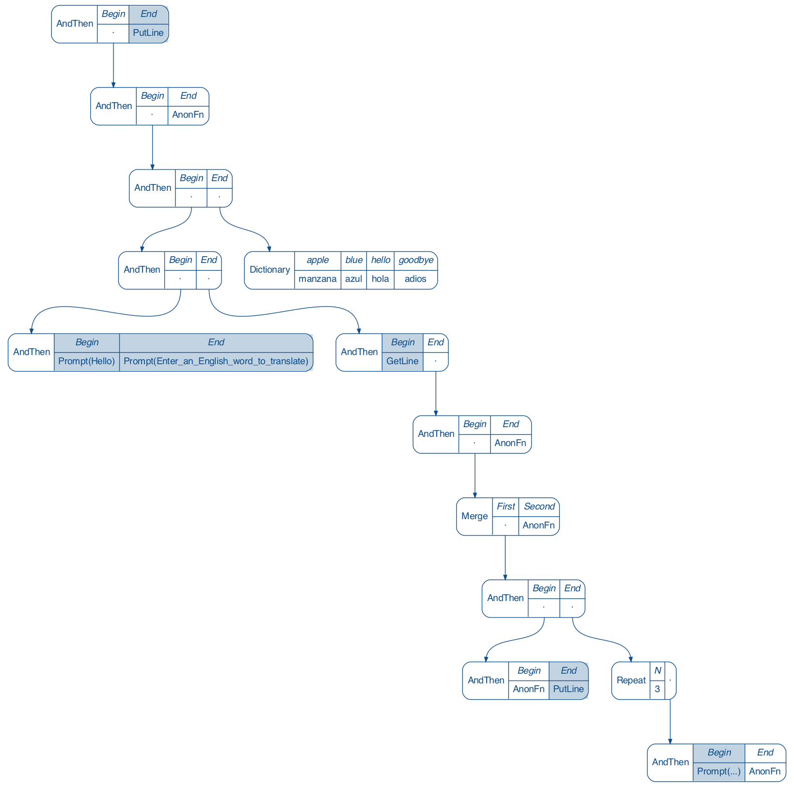

# Free Arrow

[](https://circleci.com/gh/adrielc/free-arrow/tree/master)
[](https://codecov.io/gh/adrielc/free-arrow)

Implementation of the Free Arrow in Scala and other helpful tools for working with Arrows

### Example

First define a minmal set of operations (algebra)

```scala

sealed trait ConsoleOp[A, B]
case object GetLine                 extends ConsoleOp[Unit, String]
case object PutLine                 extends ConsoleOp[String, Unit]
case class Prompt(message: String)  extends ConsoleOp[Unit, Unit]
case class Dictionary(dict: Map[String, String]) extends ConsoleOp[String, Option[String]]

``` 

Then define smart constructors to lift your algebra into the FreeArrow


```scala

val getLine = FreeArrow.lift(GetLine)
val putLine = FreeArrow.lift(PutLine)
def prompt(message: String) = FreeArrow.lift(Prompt(message))
def dictionary(entry: (String, String)*) = FreeArrow.lift(Dictionary(entry.toMap))

```  

Construct a program from your free operations 

```scala

val translator = 
    prompt("Hello") >>>
    prompt("Enter an English word to translate") >>>
    getLine -|> ( // dead end, return input to `getLine` after the following
      ("Translating " + (_: String)) >>>
        putLine >>>
        (prompt("...") >>> (_ => Thread.sleep(1000))).loopN(3)
      ) >>>
    dictionary (
      "apple" -> "manzana",
      "blue" -> "azul",
      "hello" -> "hola",
      "goodbye" -> "adios"
    ) >>> 
    (_.getOrElse("I don't know that one")) >>>
    putLine

```

Write an interpreter to do something useful with your program

```scala

val functionInterpreter: ConsoleOp ~~> Function1 = new (ConsoleOp ~~> Function1) {
  override def apply[A, B](f: ConsoleOp[A, B]): A => B = f match {
    case Prompt(message) => _ => println(message)
    case GetLine => _ => StdIn.readLine()
    case PutLine => println
    case Dictionary(dict) => dict.get
  }
}

```

Interpret and run your program

```scala

val program = translator.foldMap(functionInterpreter)

program(())

// Hello
// Enter an English word to translate
// Translating hello
// ...
// ...
// ...
// hola
```

FreeArrow supports both sequencing like FreeMonad and static analysis
of the free structure like FreeApplicative. This allows you to write 
expressive programs that can be introspected and optimized for further
sequential composition

Here's an example of introspecting the FreeArrow program to count the 
number of getLines used

```scala

import cats.implicits._

val numGets = translator.analyze(new (ConsoleOp ~~> λ[(α, β) => Int]) {
  override def apply[A, B](f: ConsoleOp[A, B]): Int = f match {
    case GetLine => 1
    case _ => 0
  }
})

```

It is also possible to generate documentation from your free program.
Here is the output of an interpreter that draws a computation graph. 


 


### Usage

Add this to your `build.sbt`:

```scala
libraryDependencies += "com.adrielc" %% "free-arrow" % "<version>"
```

Cross-builds are available for Scala 2.12.10 and 2.13.1.

### Community

Any contribution is more than welcome. Also feel free to report bugs, request features using github issues.

People are expected to follow the [Scala Code Of Conduct](https://www.scala-lang.org/conduct/) when discussing free-arrow on the Github page, Gitter channel, or other venues.

### Maintainers

* [adrielc](https://github.com/adrielc)

### License

MIT License

Written in 2020 by [Adriel Casellas](https://github.com/adrielc).
